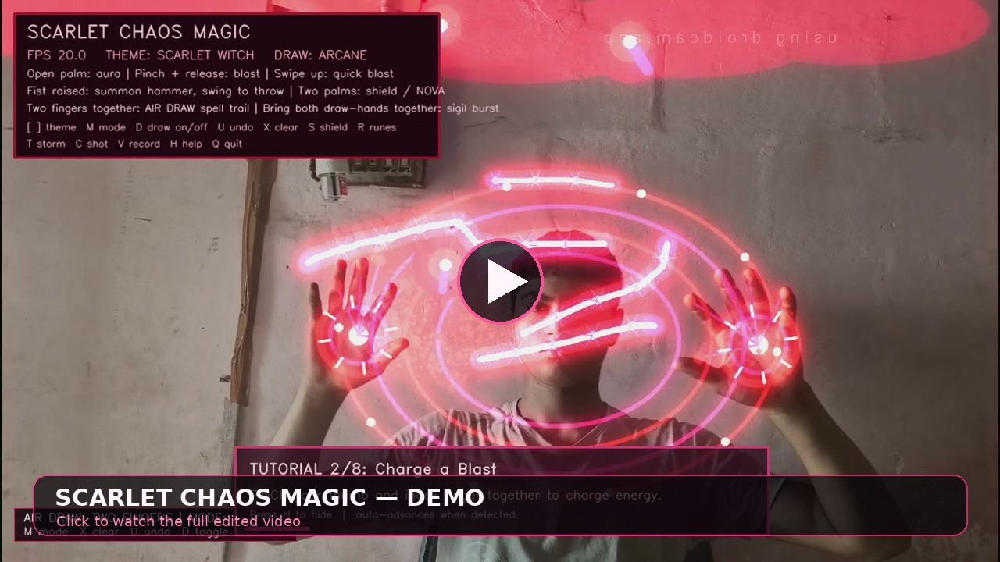
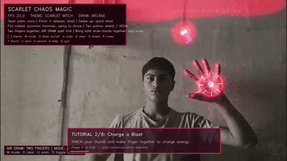

<div align="center">

# 🔮 Scarlet Chaos Magic — Air Draw V2

### Real-time hand-tracking magic, air drawing, particles, shields, runes and cinematic webcam VFX

Built with **Python**, **OpenCV**, **MediaPipe** and **NumPy**.

</div>

---

## ✨ Overview

**Scarlet Chaos Magic — Air Draw V2** is a real-time webcam VFX application that tracks your hands and turns gestures into interactive fantasy effects.

Using only your webcam, you can:

- Draw glowing symbols in the air with two fingers
- Charge and fire energy blasts
- Create quick swipe attacks
- Summon and throw a glowing hammer
- Raise a two-hand energy shield
- Trigger a powerful two-hand nova
- Change visual themes and drawing modes
- Capture screenshots and record videos
- Learn every gesture through an interactive tutorial

All effects are generated procedurally. No copyrighted movie footage, characters or visual assets are included.

---

## 🎥 Edited Demo Video

<div align="center">

<a href="assets/scarlet_chaos_magic_demo.mp4">
  
</a>

**Click the preview image to open the full edited MP4 demo.**

<details>
<summary><strong>Show animated preview</strong></summary>
<br>

</details>

</div>

The included demo has been cleaned for presentation:

- Long idle footage at the beginning was removed
- The blocked-camera ending was removed
- The silent audio track was removed
- Video was normalized to 1280×720 at 30 FPS
- Contrast and saturation were lightly enhanced
- Intro, outro and smooth fades were added
- MP4 web playback was optimized with Fast Start

Demo files:

```text
assets/scarlet_chaos_magic_demo.mp4
assets/demo-cover.jpg
assets/demo-preview.gif
```

---

## 🎬 Main Features

### 🖐 Real-Time Hand Tracking

- Tracks up to two hands
- Detects left and right hands separately
- Smooths hand movement to reduce jitter
- Calculates hand direction, movement speed and gesture state

### ✌️ Two-Finger Air Drawing

Extend your **index and middle fingers together**, keep the other fingers folded, and move your hand to draw glowing trails in the air.

Available brush modes:

- **Arcane**
- **Lightning**
- **Phoenix**
- **Cosmic**

### ⚡ Gesture-Based Magic

- Open-palm aura
- Pinch-to-charge energy
- Pinch-release projectile
- Fast upward swipe blast
- Raised-fist hammer summon
- Hammer swing and throw
- Two-palm chaos shield
- Dual-hand sigil burst
- Fully charged two-hand nova

### 🎨 Five Visual Themes

- **Scarlet Witch** — deep red and hot pink
- **Void Purple** — violet and magenta
- **Emerald Chaos** — bright green energy
- **Infinity Gold** — amber and gold
- **Frost Rune** — icy blue

### 📸 Capture Tools

- Save screenshots as PNG files
- Record the complete VFX output as MP4 video
- Files are automatically stored inside the `captures/` folder

### 🎓 Interactive Tutorial

The tutorial starts automatically on first launch. It watches your hand gestures and moves to the next step when you perform the current gesture correctly.

Press `H` anytime to restart the tutorial.

---

## 🖥 System Requirements

### Required

- Windows 10 or Windows 11
- Python **3.12 64-bit**
- Working webcam
- Recommended: 8 GB RAM or more
- Good room lighting

### Python Packages

The following packages are installed from `requirements.txt`:

```text
opencv-python==4.11.0.86
mediapipe==0.10.21
numpy==1.26.4
```

> Python 3.12 is recommended because the included MediaPipe version may not install correctly on newer unsupported Python versions.

---

## 🚀 Quick Start on Windows

### Step 1 — Extract the ZIP

Right-click the downloaded ZIP file and choose:

```text
Extract All...
```

Open the extracted `scarlet_chaos_magic` folder.

### Step 2 — Check Python 3.12

Open Command Prompt inside the project folder and run:

```bat
py -3.12 --version
```

Expected output:

```text
Python 3.12.x
```

If Python 3.12 is missing, install **Python 3.12 64-bit** and enable these installer options:

```text
Add Python to PATH
Install Python Launcher
```

### Step 3 — Run the App

Double-click:

```text
run_windows.bat
```

The script will automatically:

1. Create a virtual environment named `venv`
2. Activate the environment
3. Upgrade `pip`
4. Install all required packages
5. Launch `main.py`

The first launch may take longer because Python packages need to be installed.

---

## 🧑‍💻 Manual Installation

Open Command Prompt or the VS Code terminal inside the project folder.

### 1. Create a virtual environment

```bat
py -3.12 -m venv venv
```

### 2. Activate it

```bat
venv\Scripts\activate.bat
```

Your terminal should now begin with `(venv)`.

### 3. Upgrade pip

```bat
python -m pip install --upgrade pip
```

### 4. Install dependencies

```bat
python -m pip install -r requirements.txt
```

### 5. Start the application

```bat
python main.py
```

To stop the app, press `Q` or `Esc` while the webcam window is active.

---

## 🪄 Gesture Guide

| Gesture | Action |
|---|---|
| Hold one open palm toward the camera | Activates a glowing hand aura and finger trails |
| Pinch thumb and index finger together | Charges an energy blast |
| Release the pinch | Fires the charged energy orb |
| Perform a fast upward swipe | Fires a quick blast |
| Raise a closed fist above shoulder height | Summons the glowing hammer |
| Open and swing the hand after summoning | Throws the hammer |
| Extend index and middle fingers together | Activates air drawing |
| Bring two drawing hands together | Creates a sigil burst |
| Show two open palms | Raises the chaos shield |
| Charge both hands and bring them together | Unleashes the ultimate nova |

### Best Tracking Position

For more reliable tracking:

- Sit approximately one arm's length from the webcam
- Keep your complete hand visible
- Use bright, even lighting
- Avoid a very dark or cluttered background
- Keep fingers clearly separated when making gestures

---

## ⌨️ Keyboard Controls

| Key | Action |
|---|---|
| `M` | Change air-draw brush mode |
| `D` | Enable or disable air drawing |
| `U` | Undo the most recent drawing stroke |
| `X` | Clear all drawing strokes |
| `S` | Enable or disable the shield |
| `R` | Enable or disable rotating runes |
| `T` | Enable or disable storm effects |
| `[` | Previous color theme |
| `]` | Next color theme |
| `C` | Save a screenshot |
| `V` | Start or stop MP4 recording |
| `H` | Restart the interactive tutorial |
| `Q` | Quit the application |
| `Esc` | Quit the application |

> Keyboard shortcuts work when the webcam application window is selected.

---

## 📁 Screenshot and Recording Output

Screenshots and video recordings are saved automatically in:

```text
captures/
```

Screenshot filename example:

```text
scarlet_1720000000.png
```

Video filename example:

```text
scarlet_1720000000.mp4
```

A red `REC` indicator appears in the top-right corner while recording.

---

## 📂 Project Structure

```text
scarlet_chaos_magic/
├── main.py             # Application entry point and webcam frame loop
├── config.py           # Camera, tracking, gesture and VFX settings
├── hand_tracker.py     # MediaPipe hand detection and movement smoothing
├── gestures.py         # Gesture recognition and hand-state logic
├── chaos_magic.py      # Energy particles, blasts, shield, runes and nova
├── hammer_fx.py        # Hammer summon, throw, spin and impact effects
├── spell_painter.py    # Two-finger air drawing and brush modes
├── themes.py           # Visual color themes
├── tutorial.py         # Interactive gesture tutorial
├── recorder.py         # Screenshot and MP4 recording support
├── requirements.txt    # Required Python packages
├── run_windows.bat     # Automatic Windows setup and launcher
├── README.md           # Project documentation
├── assets/             # README demo video, cover and animated preview
│   ├── scarlet_chaos_magic_demo.mp4
│   ├── demo-cover.jpg
│   └── demo-preview.gif
└── captures/           # Generated automatically for saved media
```

---

## ⚙️ Configuration

Most settings are available in `config.py`.

### Change Webcam

If the wrong camera opens, find:

```python
device_index: int = 0
```

Try changing it to:

```python
device_index: int = 1
```

You can also try `2` if multiple cameras or virtual cameras are installed.

### Change Resolution

Default camera settings:

```python
width: int = 1280
height: int = 720
fps: int = 30
```

For better performance on a slower PC, try:

```python
width: int = 960
height: int = 540
fps: int = 30
```

### Improve Performance

In `HandTrackingConfig`, change:

```python
process_every_n_frames: int = 1
```

To:

```python
process_every_n_frames: int = 2
```

This processes hand tracking every second frame while the visual effects continue rendering.

### Change the Default Theme

In `ThemeConfig`, change:

```python
default: str = "scarlet"
```

Available values:

```text
scarlet
void
emerald
gold
ice
```

### Adjust Pinch Detection

In `GestureConfig`:

```python
pinch_distance_threshold: float = 0.045
```

- Reduce it if a pinch activates too easily
- Increase it slightly if the pinch is difficult to detect

Make small changes such as `0.040` or `0.050`.

---

## 🛠 Troubleshooting

### Python 3.12 Is Not Found

Error example:

```text
No suitable Python runtime found
```

Check installed versions:

```bat
py --list
```

Install Python 3.12 and then run:

```bat
py -3.12 --version
```

---

### Webcam Does Not Open

Error example:

```text
Could not open webcam or receive frames
```

Close applications that may already be using the camera:

- Windows Camera
- OBS Studio
- DroidCam
- Discord
- Zoom
- Microsoft Teams
- Google Meet or browser camera tabs

Then restart the project.

If the issue continues, change `device_index` in `config.py`.

---

### Black Camera Screen

- Allow camera access in Windows privacy settings
- Check that the webcam is not covered or disabled
- Disconnect and reconnect an external webcam
- Restart the PC if another program locked the camera

Windows path:

```text
Settings → Privacy & security → Camera
```

Enable camera access for desktop applications.

---

### MediaPipe Installation Fails

Confirm that the virtual environment is using Python 3.12:

```bat
python --version
```

It should display:

```text
Python 3.12.x
```

Delete the incorrectly created `venv` folder and recreate it:

```bat
rmdir /s /q venv
py -3.12 -m venv venv
venv\Scripts\activate.bat
python -m pip install -r requirements.txt
```

---

### Hand Tracking Is Jittery

- Improve room lighting
- Keep the hand closer to the camera
- Avoid strong light behind you
- Use a plain background
- Increase `smoothing_alpha` slightly in `config.py`

Higher smoothing produces steadier movement but may add a little delay.

---

### Low FPS or Lag

Try the following changes in `config.py`:

```python
width: int = 960
height: int = 540
process_every_n_frames: int = 2
max_particles: int = 450
```

Also close heavy background applications such as games, browsers, screen recorders and OBS.

---

### Keyboard Controls Do Not Work

Click once inside the webcam window and then press the required key.

The OpenCV window must be active for keyboard shortcuts to register.

---

## 🎨 Adding a Custom Theme

Open `themes.py` and add a new theme to `THEMES`, then add its key to `THEME_ORDER`.

OpenCV uses **BGR** color values, not RGB.

Example:

```python
THEMES["cosmic_blue"] = Theme(
    "Cosmic Blue",
    (255, 140, 20),
    (255, 180, 80),
    (255, 245, 235),
    (60, 15, 0),
    (110, 55, 15),
)

THEME_ORDER.append("cosmic_blue")
```

---

## 🔧 Developer Notes

The visual system uses separate off-screen buffers for glowing and sharp elements:

- `glow` stores particles and effects that should bloom
- `sharp` stores crisp highlights such as cores and rune details

Gaussian blur is applied to the glow layers before they are additively blended with the webcam frame. This creates a shader-like bloom effect using only OpenCV.

Gesture recognition is heuristic and uses MediaPipe hand landmarks, distances, finger positions and motion velocity. It is intentionally lightweight so that the application can run without a dedicated machine-learning model.

---

## 🔐 Privacy

The webcam feed is processed locally on your computer.

The application does not upload camera frames, drawings, screenshots or recordings to an online server. Media is saved only when you press the screenshot or recording controls.

---

## ⚠️ Disclaimer

This is a fan-made experimental VFX project intended for learning, creativity and entertainment. It is not affiliated with or endorsed by Marvel, Disney or any other entertainment company.

Use the application in a safe area and avoid making fast hand movements near fragile objects or other people.

---

<div align="center">

### Made with Python magic ✨

Press `H` to learn the gestures and `Q` to exit.

</div>
